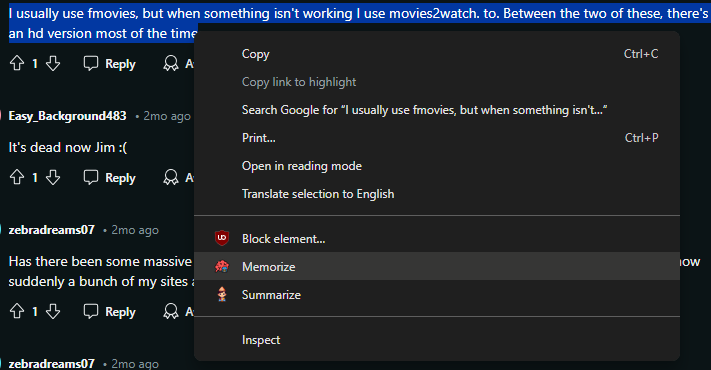
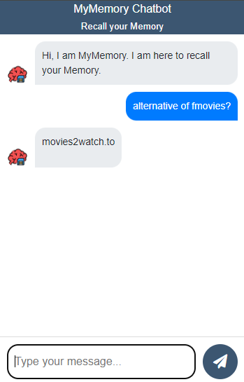

# MyMemoryAI Chrome Extension

**MyMemoryAI** is a Chrome extension that allows you to remember selected text from any website and interact with the remembered memories through an interactive chatbot.

## Features

- **Memorize Text**: Select any text on a webpage, right-click, and choose "Memorize" to save it.
- **Interactive Chatbot**: Click the extension icon to chat with a bot about your stored memories.

## Tech Stack

- **Chrome Extension**: HTML, CSS, JavaScript
- **Backend**: Python, FastAPI
- **Database**: MySQL
- **AI**: Gemini (for LLM and embedding), ChromaDB (for vector database), LangChain (for AI development)

## Setup

1. **Clone the Repository**

   ```bash
   git clone https://github.com/ArunShresthaa/MyMemoryAI.git
   ```

   Your folder structure should look like this:
   ```
    │   credentials.js
    │   manifest.json
    │   popup.html
    │   readme.md
    │
    ├───css
    │       popup.css
    │
    ├───images
    │       bot.png
    │       icon128.png
    │       icon16.png
    │       icon48.png
    │
    └───javascript
            background.js
            jquery-3.6.0.min.js
            popup.js
    ```
2. **Add Your Credentials**

    - In **credentials.js**, add your credentials:
    ```
    window.myCredentials = {
        email: '', // Your email
        password: '' // Your password
    };
    ```

    - In **javascript/background.js**, set your credentials:

    ```
    let email = ""; // Your email
    let password = ""; // Your password
    ```

## Installation

1. Go to Chrome's extension manager at `chrome://extensions/`.
2. Enable Developer Mode.
3. Click on "Load unpacked".
4. Navigate to the extension folder and select it.
5. Pin the extension for quick access.
6. **Done!** You have successfully installed the MyMemory Chrome Extension.

## Usage

- **To Memorize Text**: Select any text on a webpage, right-click, and choose "Memorize".

- **To Chat**: Click the extension icon and interact with the chatbot about your stored memories.


## Contributing

Feel free to contribute to the project by submitting issues or pull requests.